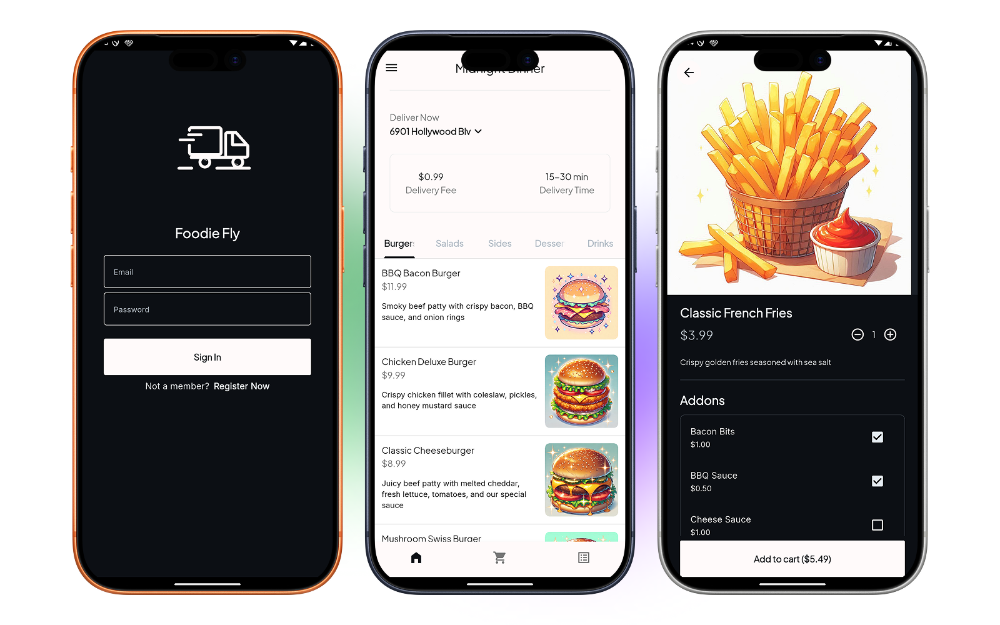
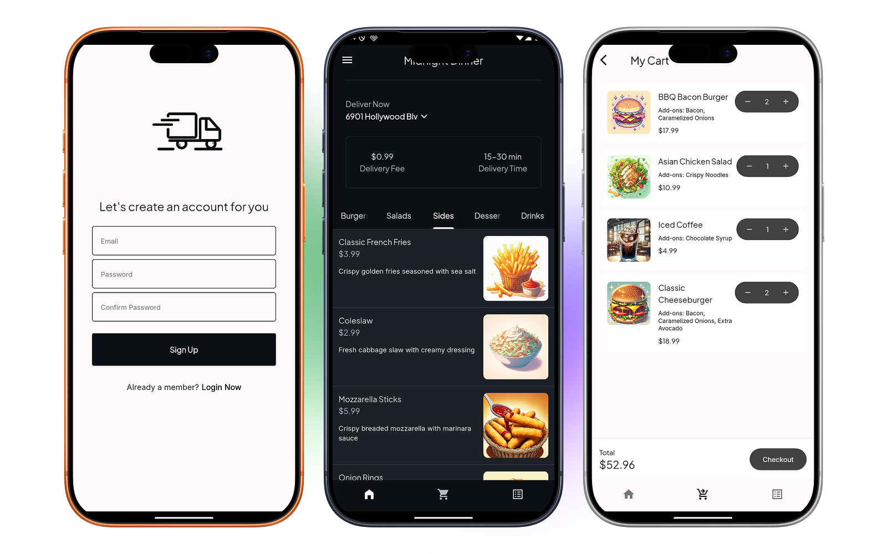
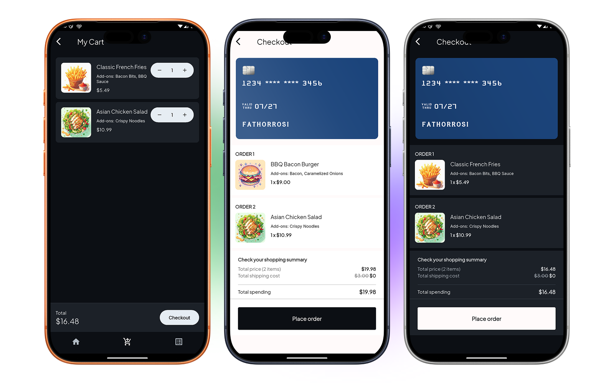

# Foodie Fly

A cross-platform Flutter food-ordering demo app using Firebase (Authentication + Firestore), BLoC state management, and a clean layered architecture.

Table of contents
- [Features](#features)
- [Tech stack](#tech-stack)
- [Quick start](#quick-start)
  - [Prerequisites](#prerequisites)
  - [Firebase setup](#firebase-setup)
  - [Configure project files](#configure-project-files)
  - [Install & run](#install--run)
- [Architecture overview](#architecture-overview)
- [Routes / Screens](#routes--screens)
- [Data layer & Firestore notes](#data-layer--firestore-notes)
- [Running tests](#running-tests)
- [Troubleshooting & tips](#troubleshooting--tips)
- [Contributing](#contributing)
- [License](#license)

## Features
- Email/password authentication (Firebase Auth)
- Browse foods by category
- Food detail view with addons and quantity selection
- Add to cart, update/remove cart items
- Checkout and delivery progress screens
- Offline-capable image loading via cached_network_image
- Clean layered architecture (presentation / domain / data)
- DI with get_it and state management with flutter_bloc
- Navigation using go_router

## Tech stack
- Flutter (Dart)
- Firebase Auth & Firestore
- flutter_bloc, get_it, go_router
- cached_network_image, lottie, loading_animation_widget, flutter_slidable, shared_preferences
- Project entry: `lib/main.dart`

---

## Quick start

### Prerequisites
- Flutter SDK (matching the project's environment). This repo's pubspec specifies `sdk: ^3.10.7`. Install Flutter: https://docs.flutter.dev/get-started/install
- Android Studio / Xcode / VS Code (for device/emulator)
- A Firebase project with Firestore and Authentication enabled

### Firebase setup (required)
This project expects Firebase configured on each platform.

1. Create a Firebase project at https://console.firebase.google.com/
2. Enable:
   - Authentication -> Email/Password sign-in
   - Firestore Database (in native mode)
3. Add Android app:
   - Register package (match `android/app/src/main/...` package name; check `android/app/src/main/kotlin/.../MainActivity.kt`)
   - Download `google-services.json`
   - Place it at `android/app/google-services.json` (this repo already contains one as an example — replace with your own)
4. Add iOS app:
   - Register iOS bundle id
   - Download `GoogleService-Info.plist`
   - Place it at `ios/Runner/GoogleService-Info.plist`
   - In Xcode enable `Push Notifications`/`Background Modes` only if needed
5. Update Firestore rules for development (or configure secured rules for production).

Important: Do NOT commit your own `google-services.json`/`GoogleService-Info.plist` to a public repository.

### Configure project files
- Review `lib/injection.dart` — the app registers Firebase instances and SharedPreferences via GetIt.
- If you change collection names in Firestore, update the remote data source queries in:
  - `lib/data/data_source/remote/remote_data_source.dart`
- The app stores user session with `SharedPreferences` via `UserSessionManager` -> check `lib/data/data_source/local/user_session_manager.dart`.

### Install & run
Open a terminal at repo root:

1. Get dependencies
   - flutter pub get

2. Run on a connected device or emulator
   - flutter run
   - To choose a device: flutter run -d <device_id>
   - To run on a specific platform:
     - Android emulator: flutter emulators --launch <name> then flutter run
     - iOS simulator: open Xcode or run `open -a Simulator` then flutter run

3. Build release APK / IPA
   - Android (release): flutter build apk --release
   - iOS (release): flutter build ipa (requires Xcode + code signing)

---

## Architecture overview
This project uses a layered approach:

- presentation/
  - UI pages & widgets (BLoC providers, app scaffold, custom components)
  - Example: `lib/presentation/pages/login_page/login_page.dart`
- domain/
  - Entities, repository interfaces, usecases
  - Example usecases: `lib/domain/usecases/get_foods.dart`, `add_to_cart.dart`
- data/
  - Remote & local data sources, models, repository implementations
  - Remote calls live in `lib/data/data_source/remote/remote_data_source.dart`
  - Repository implementation: `lib/data/repositories/repository_impl.dart`

Dependency injection:
- `lib/injection.dart` registers singletons and factories using `get_it`.
- `main.dart` calls `await di.init()` after Firebase initialization.

State management:
- BLoC (flutter_bloc)
  - AuthBloc (auth state & redirects)
  - FoodsBloc (foods loading per category)
  - AddonsBloc (addons per category)
  - CartBloc (load/add/update/remove cart items)

Navigation:
- go_router configured in `lib/utils/router.dart`. Routes are declared centrally and guarded via AuthBloc state.

---

## Routes / Screens
Routes defined in `lib/utils/router.dart`:
- `/` — Login (AppScaffold wrapped)
- `/register` — Register page
- `/navbar` — Main navigation wrapper
- `/home` — HomePage (menu tabs)
- `/food_detail_page` — Food detail (expects a FoodEntity as extra)
- `/cart` — CartPage
- `/order` — Order page
- `/checkout` — Checkout page (expects List<CartItemEntity> as extra)
- `/delivery` — Delivery progress (expects List<CartItemEntity> as extra)

You can navigate programmatically using go_router:
- context.go('/home');
- context.push('/food_detail_page', extra: myFoodEntity);

---

## Data layer & Firestore notes
- RemoteDataSource uses Firestore collections: `foods`, `addons`, `carts`.
- cart query attempts to order by `createdAt` (descending). If Firestore requires a composite index (failed-precondition), the code falls back to an unordered query and sorts items in memory. See:
  - `lib/data/data_source/remote/remote_data_source.dart` — this file contains the logic & helpful error messages.
- Add-to-cart flow:
  - UI -> CartBloc -> AddToCart usecase -> RepositoryImpl -> RemoteDataSource
  - The repository calculates total price and throws a FirestoreFailure if remote operations fail.
- Models & Entities:
  - DTOs live in `lib/data/model/` and map to Entities in `lib/domain/entities/`.

Security note:
- Keep Firestore security rules and user authentication enforced for production. Do not allow open reads/writes.

---

## Running tests
- Run unit & widget tests:
  - flutter test
- There is a sample widget test in `test/widget_test.dart`. Extend tests for BLoC and repositories.

---

## Troubleshooting & tips
- Firebase initialization error:
  - Ensure `google-services.json` (Android) and `GoogleService-Info.plist` (iOS) are present and match your Firebase project.
- Firestore "failed-precondition" when querying:
  - Either create the needed index via the Firestore console (the error message will contain a direct link), or rely on the fallback implemented in `RemoteDataSourceImpl` (it will fetch results unordered then sort in memory).
- Auth redirect loop:
  - AuthBloc controls redirect logic in `lib/utils/router.dart`. If you get stuck, inspect `AuthBloc` events (`CheckAuthStatusEvent`, `LoginEvent`, etc.).
- Images not loading:
  - The app uses `CachedNetworkImage` — ensure remote image URLs in Firestore are reachable.
- Debugging:
  - Use Flutter DevTools, print logs from blocs (or add logging within bloc transitions).
- SharedPreferences:
  - `UserSessionManager` uses SharedPreferences for storing session data. If user session appears stale, clear app data or `SharedPreferences`.

---

## Contributing
Contributions are welcome! A suggested workflow:
1. Fork the repo and create a feature branch.
2. Follow the existing architecture: add usecases in domain, repository implementations in data, and BLoC/UI changes in presentation.
3. Add tests for new logic.
4. Open a PR describing changes and include screenshots or gifs for UI changes.

Please keep commits small and focused.

---

## Where to look in the code
- App bootstrap: `lib/main.dart`
- DI setup: `lib/injection.dart`
- Router / guards: `lib/utils/router.dart`
- BLoC examples:
  - `lib/presentation/bloc/auth_bloc/`
  - `lib/presentation/bloc/foods_bloc/`
  - `lib/presentation/bloc/cart_bloc/`
- Remote data source: `lib/data/data_source/remote/remote_data_source.dart`
- Repository: `lib/data/repositories/repository_impl.dart`
- Presentation pages: `lib/presentation/pages/`

---

## License
This project currently does not include a formal license file. If you intend to open-source it, add a LICENSE at the repository root (e.g., MIT, Apache-2.0).

---

If you'd like, I can:
- Add a CONTRIBUTING.md template
- Add example Firestore seed data (JSON) for quick local testing
- Create a checklist for production readiness (security rules, Crashlytics, analytics)